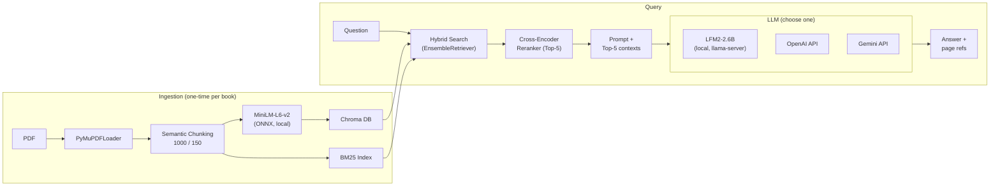

# BookMind - Local AI teacher for any textbook

[](https://huggingface.co/spaces/Ksirailway/BookMind)

Offline RAG assistant for studying with text-based PDF textbooks. Powered with [**LFM2-2.6B**](https://huggingface.co/LiquidAI/LFM2-2.6B) on board. LFM2 is Liquid AI's hybrid architecture — efficient enough to run on RAM-only machines without a GPU. 
This project is my first test of LFM2 in a real RAG pipeline, with plans to explore its limits on low-power local servers. More LFM2 experiments coming. 

> Upload a book, ask questions, get answers with page references. Everything runs locally via llama.cpp. Optionally switch to OpenAI or Gemini via API key.

---

## 🌟 Featured In

This project is officially featured in the [**Liquid4All Cookbook**](https://github.com/Liquid4All/cookbook) as a comprehensive example of a complex RAG application built with Liquid AI models.

---

### Key Features

- **Conversational Memory**: Implements a **Two-Tier Summary Buffer**. It keeps the last 12 messages "hot" (word-for-word) and automatically compresses older history into a lightweight summary block (extracting discussed topics and pages). This prevents context overflow while maintaining long-term session memory.
- **Smart Chunking**: PyMuPDF loader with 1800-char chunks and 500-char overlap. Optimized to capture **Word Banks** and exercise instructions together.
- **Retrieve & Rank**: Two-stage RAG pipeline. Initial Hybrid Search followed by a **Cross-Encoder Reranker** (MiniLM-L6) to ensure the highest semantic accuracy.
- **Exercise Generator**: Automatically extracts grammar exercises from textbook pages. No hallucinations — exercises are taken directly from the book with all provided options/word banks.
- **Active Task Context**: The assistant remembers the current exercise and can explain rules and check answers in context.
---
## Architecture


## Requirements

- **Python** 3.10+
- **CUDA 12.4** recommended for GPU inference; CPU works without it

## Quick Start

### 1. Setup
```bash
setup.bat
```
Creates venv, installs dependencies, and downloads llama.cpp binaries.  
During setup you'll be prompted to choose:
- `1` — **CUDA 12.4** (GPU, recommended for NVIDIA)
- `2` — **CPU only** (no GPU required)

### 2. Download LFM2 Model

Download the GGUF and place it in the `models/` folder:

| Model | Description |
|-------|-------------|
| [LFM2-2.6B-GGUF](https://huggingface.co/LiquidAI/LFM2-2.6B-GGUF/resolve/main/LFM2-2.6B-Q4_K_M.gguf?download=true) | Liquid AI's hybrid model, optimized for edge/on-device inference |

> `run.bat` auto-detects the first `.gguf` file in `models/`.

### 3. Run
```bash
run.bat
```
- If a `.gguf` model is in `models/` → starts llama-server + Gradio app
- If no model → starts in cloud-only mode (use API key in the UI)

Opens at `http://127.0.0.1:7860`

## Usage

1. **Select a book** from the dropdown (PDFs in `books/` are auto-detected)
2. **Choose LLM provider:**
   - **Local** — uses llama-server (must have a model in `models/`)
   - **OpenAI** — paste your API key, uses `gpt-4o-mini` by default
   - **Gemini** — paste your API key, uses `gemini-2.5-flash-lite` by default
3. **Ask away:**
    - **Question mode:** Just ask any question about the book content.
    - **Homework Check:** Include trigger words like `homework`, `check`, or `evaluate` in your message to get grammar feedback with rule citations.
    - **Exercise mode:** Say "give me a task" or "give me an exercise" to get a real exercise extracted from the book with blanks to fill in.
    - **Follow-up:** After getting an exercise, you can ask for hints, explanations, or corrections.

### Upload New Books

Use the **Upload PDF** button in the sidebar or drop PDFs into `books/`.

## Project Structure

```
├── app.py              # Gradio web interface
├── rag_engine.py       # RAG pipeline (ingest, hybrid search, query)
├── prompt_builder.py   # LangChain prompts (question, homework, task)
├── task_generator.py   # Regex parser for exercise extraction
├── llm_client.py       # LLM provider connections (local/OpenAI/Gemini)
├── requirements.txt    # Python dependencies
├── setup.bat           # One-time setup
├── run.bat             # Launch script
├── books/              # PDF textbooks (gitignored)
├── models/             # .gguf model files (gitignored)
├── bin/                # llama.cpp binaries (gitignored)
└── chroma_db/          # Vector store (gitignored, auto-created)
```

## Stack

| Component | Technology |
|-----------|-----------|
| Framework | LangChain |
| Vector DB | Chroma |
| Embeddings | all-MiniLM-L6-v2 (ONNX, local) |
| Local LLM | LFM2-2.6B via llama.cpp |
| Cloud LLM | OpenAI / Gemini (optional) |
| Reranker | ms-marco-MiniLM-L-6-v2 (local) |
| UI | Gradio |
| PDF Parser | PyMuPDF (fitz) |

## Planned Features

- [ ] Math textbook support — detect equations and problem sets
- [ ] Scientific paper mode — Q&A over research papers (abstract, methodology, conclusions)
- [ ] Book type auto-detection — switch modes automatically based on content
- [ ] OCR fallback for scanned PDFs
- [ ] Answer verification — check student answers against book key

## Known Limitations

- Optimized for text-based PDFs. Scanned PDFs require OCR (not yet supported).
- Exercise extraction works best with grammar textbooks (Murphy-style format).
- Math and scientific PDF modes are in development.

## License

MIT
